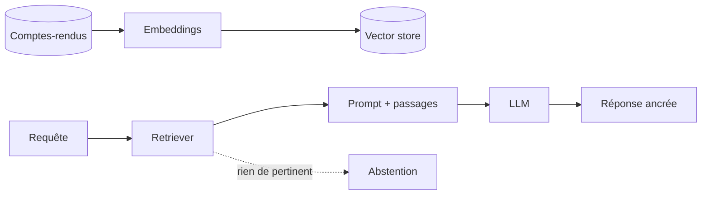

# RAG — conception (sans implémenter) — Mini-cours

> Brief associé : M7-B2
> Durée de lecture : ~25 min
> Pré-requis : notion d'embeddings (M0-B0), LLM (acculturation)

## Pourquoi cette techno ?

Un LLM seul **hallucine** et ne connaît pas vos documents internes. Le **RAG**
(Retrieval-Augmented Generation) branche le LLM sur **votre corpus** : il
**retrouve** les passages pertinents et les **injecte** dans le prompt. Pour
MediVox, ça permettrait d'exploiter les **comptes-rendus médicaux** (texte) que
le modèle tabulaire ignore. En M7-B2 on **conçoit** un RAG (schéma + coût +
risques) — on ne l'implémente pas.

## Concepts clés

- **Embeddings** : transformer un texte en vecteur (sentence-transformers). Des
  textes proches sémantiquement ont des vecteurs proches.
- **Vector store** : base qui indexe les vecteurs (ChromaDB, FAISS) pour une
  recherche par similarité rapide.
- **Retriever** : à partir d'une requête, retrouve les **k** passages les plus
  proches dans le vector store.
- **Prompt template** : assemble la question + les passages retrouvés + des
  consignes, envoyés au LLM.
- **Le LLM génère** la réponse **ancrée** sur les passages (moins d'hallucination).
- **Fallback** : si le retriever ne trouve pas de contexte pertinent →
  **abstention** (ne pas répondre plutôt que d'inventer).
- **Limites santé** : explicabilité d'un LLM faible, données sensibles envoyées à
  une API ? → conformité AI Act tendue.

## Exemple minimal qui tourne

## Exercice guidé

Concevez (schéma + 3 lignes) un RAG pour enrichir la prédiction DMS :
1. Quelle source de texte ? Quel embedding ? Quel vector store ?
2. Que met-on dans le prompt ?
3. Quel fallback si le RAG ne trouve rien ?

## Pièges fréquents

| Piège | Conséquence |
|---|---|
| RAG sans fallback | Le LLM hallucine quand il ne trouve rien |
| Envoyer des données santé à une API externe | Risque RGPD/conformité majeur |
| Croire que RAG = pas d'hallucination | Réduit, pas supprime |
| Sur-dimensionner pour un cas tabulaire | Coût injustifié si le texte n'apporte rien |
| Oublier l'explicabilité | AI Act santé tendue |

| Symptôme | Cause probable |
|---|---|
| Réponses inventées | retriever vide + pas d'abstention |
| Coût qui explose | chunks trop gros / trop d'appels LLM |
| Conformité bloquée | données sensibles hors UE / non maîtrisées |

## Pour aller plus loin

- ChromaDB : https://docs.trychroma.com/
- sentence-transformers : https://www.sbert.net/

## Vérification (checklist apprenant)

- [ ] Je nomme les composants : embeddings / vector store / retriever / prompt / LLM.
- [ ] Mon schéma RAG inclut un **fallback** (abstention).
- [ ] Je signale le risque conformité (données santé + explicabilité).
- [ ] Je sais dire si le texte apporte un gain (ou non) pour ce cas.
- [ ] Je **conçois** sans implémenter.

> 💡 **Récap** : RAG = embeddings → vector store → retriever → prompt → LLM, pour
> **ancrer** la génération sur **vos** documents. Toujours un **fallback** (abstention
> si pas de contexte). En santé : explicabilité faible + données sensibles → conformité
> AI Act **tendue**. On **conçoit** (schéma + coût + risques), on n'implémente pas.
