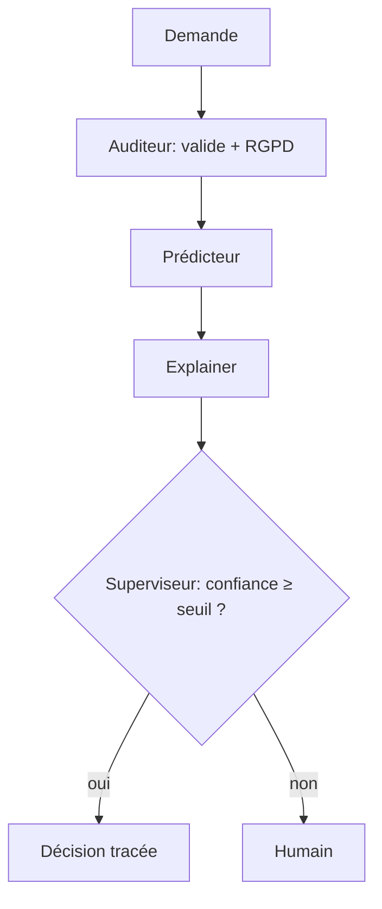

# Multi-agents (LangGraph) — conception — Mini-cours

> Brief associé : M7-B2
> Durée de lecture : ~25 min
> Pré-requis : notion de LLM, conception RAG (mini-cours 02)

## Pourquoi cette techno ?

Une architecture **multi-agents** découpe une tâche en **agents spécialisés** qui
coopèrent (un valide, un prédit, un explique, un supervise). C'est séduisant —
modulaire, supervision humaine native — mais **coûteux et complexe**. En M7-B2 on
**conçoit** l'option C pour la **comparer**, en gardant un œil critique : sur un
problème tabulaire simple, des agents sont souvent du **sur-engineering**.

## Concepts clés

- **Agent** : une unité (souvent un LLM + des outils) avec un rôle précis et la
  capacité de décider de l'étape suivante.
- **Orchestration (LangGraph)** : un graphe d'états qui relie les agents ; chaque
  nœud transforme un **état partagé** et choisit la transition.
- **État partagé** : le contexte qui circule entre agents (input, prédictions,
  justifications, niveau de confiance).
- **HITL natif** : un agent **superviseur** peut router vers un humain si la
  confiance est faible — atout pour l'AI Act (supervision humaine).
- **Coût de la complexité** : plus d'appels LLM, debug difficile, observabilité
  exigeante, points de panne multiples.
- **Quand c'est justifié** : workflows réellement multi-étapes hétérogènes — **pas**
  une simple prédiction tabulaire.

## Exemple minimal qui tourne

## Exercice guidé

Concevez (schéma + 3 lignes) l'option C pour MediVox :
1. Quels agents, quel rôle chacun ?
2. Quel état partagé circule ?
3. Quand le superviseur route-t-il vers un humain ?
4. **Question critique** : ce découpage se justifie-t-il pour prédire une DMS ?

## Pièges fréquents

| Piège | Conséquence |
|---|---|
| Des agents pour une tâche mono-étape | Sur-engineering caractérisé |
| Pas d'état partagé clair | Agents qui ne coopèrent pas vraiment |
| Oublier l'observabilité | Debug impossible en prod |
| Confondre « agent » et « fonction » | Complexité gratuite |
| Recommander C sans gain démontré | Signal négatif (jury / client) |

| Symptôme | Cause probable |
|---|---|
| Latence cumulée élevée | trop d'appels LLM en chaîne |
| Coût d'exploitation fort | orchestration + LLM partout |
| Conformité difficile à prouver | flux complexe peu traçable |

## Pour aller plus loin

- LangGraph : https://langchain-ai.github.io/langgraph/
- AI Act — supervision humaine : https://artificialintelligenceact.eu/the-act/

## Vérification (checklist apprenant)

- [ ] Je définis agent / orchestration / état partagé.
- [ ] Mon schéma C inclut un superviseur + HITL.
- [ ] Je sais nommer le coût de la complexité.
- [ ] Je juge **honnêtement** si des agents se justifient ici (souvent non).
- [ ] Je **conçois** sans implémenter.

> 💡 **Récap** : des **agents spécialisés** coopèrent via un **état partagé**
> (orchestration). Atout : HITL natif (agent superviseur). Coût : complexité, debug,
> observabilité, points de panne. Pour une prédiction tabulaire simple = souvent
> **sur-engineering** — à juger honnêtement.
